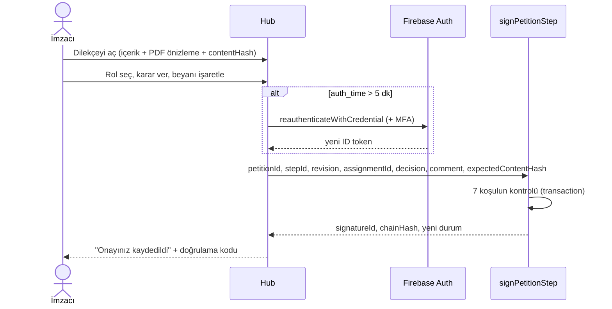

# ADR-0012: Rol bazlı sistem içi elektronik onay (5070 e-imzası değildir)

- **Durum:** Önerildi
- **Tarih:** 2026-09-22
- **Karar vericiler:** TechOps Başkanlığı; onay: Yönetim Kurulu, Danışman görüşü
- **İlgili:** WP-12, ADR-0009, ADR-0013, ADR-0015, AS-07, AS-08, AS-13, AS-14

> **Uygulama notu (2026-09-24):** Koşul 1, 2, 4, 5 ve 7 uygulanır (2: son 15 dakika içinde giriş, kurallarda `auth_time`). Koşul 3 (MFA) AS-13'e bağlıdır. Koşul 6 (içerik özeti) yerine kurallar onay sürecinde içeriğin değiştirilmesini doğrudan engeller. Hash zinciri (§4) yoktur; önceki onayların değiştirilemezliği kurallarla sağlanır. Bkz. [ADR-0017](0017-ucretsiz-spark-plani-kurallar-tek-guvenilir-katman.md).

## Bağlam

Dilekçelerin "online olarak rol bazlı imzalanması" istenmektedir. "İmza" kelimesinin hukuki anlamı konusunda açık olmak gerekir:

- **5070 sayılı Elektronik İmza Kanunu**'na göre yalnızca **güvenli elektronik imza** (nitelikli sertifikayla oluşturulan, e-imza kartı veya mobil imza) ıslak imzayla aynı hukuki sonucu doğurur. Bunun için her imzacının nitelikli sertifikası olmalı ve bir elektronik sertifika hizmet sağlayıcısıyla entegrasyon kurulmalıdır. Bu, bir öğrenci topluluğu için maliyetli ve gereksizdir.
- Öğrenci kolunun iç dilekçeleri (etkinlik izni, görev talebi, harcama talebi vb.) bir **iç karar/onay** sürecidir. Burada gereken; kimin, hangi rolle, hangi içeriği, ne zaman onayladığının **inkâr edilemez ve doğrulanabilir** biçimde kaydedilmesidir.

## Karar

1. Hub'daki imza, **sistem içi elektronik onay** olarak tanımlanır. Arayüzde ve PDF'te "Elektronik olarak onaylanmıştır" ifadesi kullanılır. "Elektronik imza" veya "e-imza" ifadeleri **kullanılmaz.**
2. Bir onayın geçerli sayılması için aşağıdaki koşulların **tamamı** sunucuda doğrulanır:

   | # | Koşul | Amaç |
   |---|---|---|
   | 1 | Kullanıcı Firebase Auth ile giriş yapmış, üyeliği aktif | Kimlik |
   | 2 | Kimlik jetonunun `auth_time` değeri son 5 dakika içinde (yeniden giriş) | Oturumu açık bırakılmış cihazda başkasının imzalamasını önlemek |
   | 3 | MFA etkinse ikinci faktör doğrulanmış (AS-13) | Güçlü kimlik |
   | 4 | Seçilen rol ataması imza anında aktif ve kapsamı dilekçe adımıyla eşleşiyor | Rol bazlılık |
   | 5 | İmzacı dilekçe sahibi değil | Görevler ayrılığı |
   | 6 | İmzacının onayladığını gördüğü içerik özeti (`expectedContentHash`), saklanan özetle aynı | "Gördüğünü imzalama" |
   | 7 | Açık beyan kutusu işaretlenmiş | İrade beyanı |

3. İmza kaydı; imzacı, **imza anındaki rol ve kapsam**, ikame bilgisi, karar, gerekçe, sunucu zamanı, içerik özeti ve kimlik doğrulama bağlamını içerir ([veri modeli §6](../moduller/e-dilekce/veri-modeli.md)).
4. Aynı dilekçenin imzaları bir **hash zinciri** oluşturur: `chainHash = SHA-256(prevChainHash ‖ JCS(imza çekirdeği))`. Bir imza kaydı sonradan değiştirilirse veya silinirse zincir doğrulaması başarısız olur.
5. İmza kayıtları değiştirilemez ve silinemez. Bu kural Security Rules ile uygulanır; yalnızca Functions oluşturabilir.
6. Kişi daha sonra rolünü kaybederse **geçmiş imzaları geçerli kalır.** İmza, imza anındaki role göre değerlendirilir.
7. Üniversiteye veya harici kurumlara gidecek ve ıslak/e-imza gerektiren belgelerde şablon `externalSignatureRequired: true` olarak işaretlenir. Hub onayı iç süreci tamamlar. PDF ayrıca ilgili kişi tarafından ıslak imza veya kendi e-imzasıyla imzalanır (AS-08).
8. El imzası görseli ilk dönemde **kullanılmaz** (AS-14). PDF'teki imza bloğu metin tabanlıdır: ad-soyad, unvan, karar, tarih-saat, doğrulama kodu.

## İmza akışı

## Değerlendirilen seçenekler

| Seçenek | Artılar | Eksiler |
|---|---|---|
| Sistem içi elektronik onay + hash zinciri (seçilen) | Ücretsiz, hızlı, iç süreç için yeterli kanıt | Islak imza hukuki eşdeğerliği yok (gerekmiyor) |
| 5070 uyumlu güvenli e-imza entegrasyonu | Hukuki eşdeğerlik | Her imzacı için nitelikli sertifika, sağlayıcı entegrasyonu ve maliyet gerekir. Öğrenciler için gerçekçi değil. |
| Taranmış el imzası görseli yapıştırma | Alışılmış görünüm | Kanıt değeri yoktur, kolayca kopyalanır. Güvenlik açısından yanıltıcıdır. |
| Harici imza servisi (DocuSign vb.) | Hazır çözüm | Maliyet, veri yurt dışında üçüncü tarafta, RBAC entegrasyonu zayıf |

## Sonuçlar

**Olumlu:** İç süreçte "kim onayladı?" tartışması ortadan kalkar. Onaylar doğrulanabilir hâle gelir.

**Olumsuz:** Her imzada yeniden giriş gerekir. Bu küçük bir sürtünmedir; güvenlik karşılığında bilinçli olarak kabul edilir.

**Riskler:**
- *Hesap paylaşımı:* Kişisel hesaplar paylaşılmaz (Bildirge §12.4). Kural kullanım koşullarına eklenir. MFA bu riski büyük ölçüde azaltır.
- *Hukuki yanlış anlama:* Arayüzde ve PDF'te kullanılan ifade Danışman görüşüyle kesinleştirilir.

## Uygulama notları

- İstemci `getIdTokenResult()` ile `auth_time` değerini kontrol eder. Sunucu **ayrıca** `decodedToken.auth_time` değerini kontrol eder.
- JCS için `canonicalize` (RFC 8785) paketi kullanılır. Hash hesaplama `packages/shared/src/crypto/` altında, test vektörleriyle birlikte yer alır.
- Zincir doğrulama fonksiyonu (`verifySignatureChain`) hem doğrulama sayfasında hem gece çalışan bütünlük kontrolünde kullanılır.
