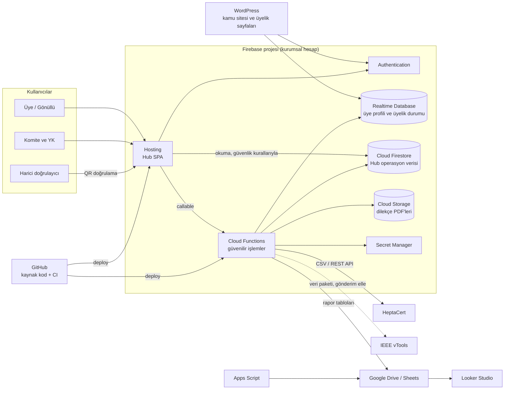
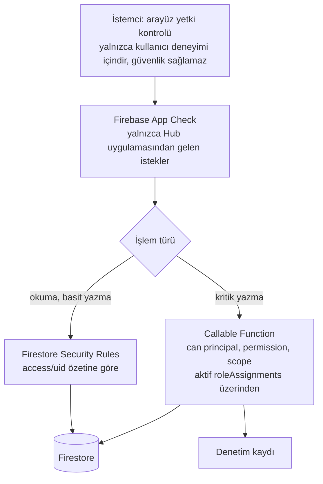
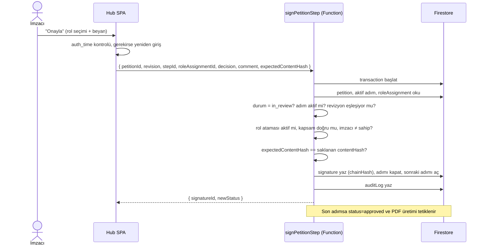

# Sistem Mimarisi

> **Güncelleme (2026-09-24):** Bu doküman Blaze + Cloud Functions varsayımıyla yazılmış **hedef** mimaridir. Blaze alınamadığı için (AS-06) uygulanan mimari farklıdır: [Uygulanan mimari](uygulanan-mimari.md), [ADR-0017](../adr/0017-ucretsiz-spark-plani-kurallar-tek-guvenilir-katman.md).

Bildirge §6'daki hedef mimarinin Hub açısından somutlaştırılmış hâlidir. Kararların gerekçeleri ADR'lerdedir.

## 1. Bağlam diyagramı

## 2. Bileşenler

| Bileşen | Sorumluluk | ADR |
|---|---|---|
| Hub SPA (`apps/hub`) | Kullanıcı arayüzü. Okumaları güvenlik kurallarıyla doğrudan Firestore'dan yapar. Kritik yazmalar için callable fonksiyon çağırır. | [0002](../adr/0002-hub-uygulama-yigini.md) |
| Firebase Auth | Tek kimlik. WordPress üyelik sistemiyle ortak kullanılır. | Bildirge §6.3 |
| Realtime Database | Üye profili ve üyelik durumunun **ana kaydı**. Hub bu veriyi değiştirmez, yalnızca yansıtır. | [0003](../adr/0003-hub-veri-deposu-firestore.md) |
| Cloud Firestore | Hub'ın tüm operasyon verisi: birimler, roller, görevler, etkinlikler, dilekçeler, denetim kayıtları. | [0003](../adr/0003-hub-veri-deposu-firestore.md) |
| Cloud Functions (`functions/`) | Rol atamaları, dilekçe durum geçişleri ve imzalar, evrak numarası, PDF üretimi, içe aktarma, zamanlanmış işler, denetim kaydı. | [0004](../adr/0004-guvenilir-backend-cloud-functions.md), [0006](../adr/0006-yetki-uygulama-noktalari.md) |
| Cloud Storage | Onaylanmış dilekçe PDF'leri. İstemci doğrudan okuyamaz, kısa ömürlü imzalı URL ile indirir. | [0015](../adr/0015-pdf-uretimi-ve-dogrulama.md) |
| Secret Manager | HeptaCert API anahtarı ve diğer gizli bilgiler | Bildirge §10.6 |
| Google Drive / Sheets | Belge arşivi, finans ana kaydı, raporlama veri katmanı | Bildirge §6.7–6.9 |

## 3. Güvenlik katmanları

Kural: Güvenliğin kaynağı **sunucudur** (Functions + Security Rules). Arayüzde gizlenen bir düğme güvenlik önlemi sayılmaz.

## 4. Kritik akış: Dilekçe imzalama

## 5. Ortamlar

| Ortam | Firebase projesi | Veri | Kullanım |
|---|---|---|---|
| `local` | Emulator Suite | Sentetik seed verisi | Geliştirme, birim ve kural testleri |
| `staging` | Ayrı Firebase projesi | Sentetik veri, **gerçek kişisel veri yok** | PR önizleme kanalları, pilot öncesi kabul |
| `production` | Kurumsal Firebase projesi (mevcut üyelik projesi) | Gerçek veri | Canlı |

Geliştiriciler üretim verisine erişmez. Üretim verisiyle hata ayıklama gerekiyorsa acil erişim süreci uygulanır ([ADR-0010](../adr/0010-teknik-erisim-ve-acil-erisim.md)).

## 6. Bölge

Firestore, Functions ve Storage için `europe-west3` (Frankfurt) önerilir (AS-11). Firestore bölgesi **proje oluşturulduktan sonra değiştirilemez**. Mevcut RTDB'nin bölgesi WP-01 envanterinde tespit edilecektir (AS-10).
