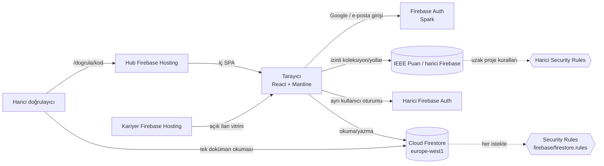
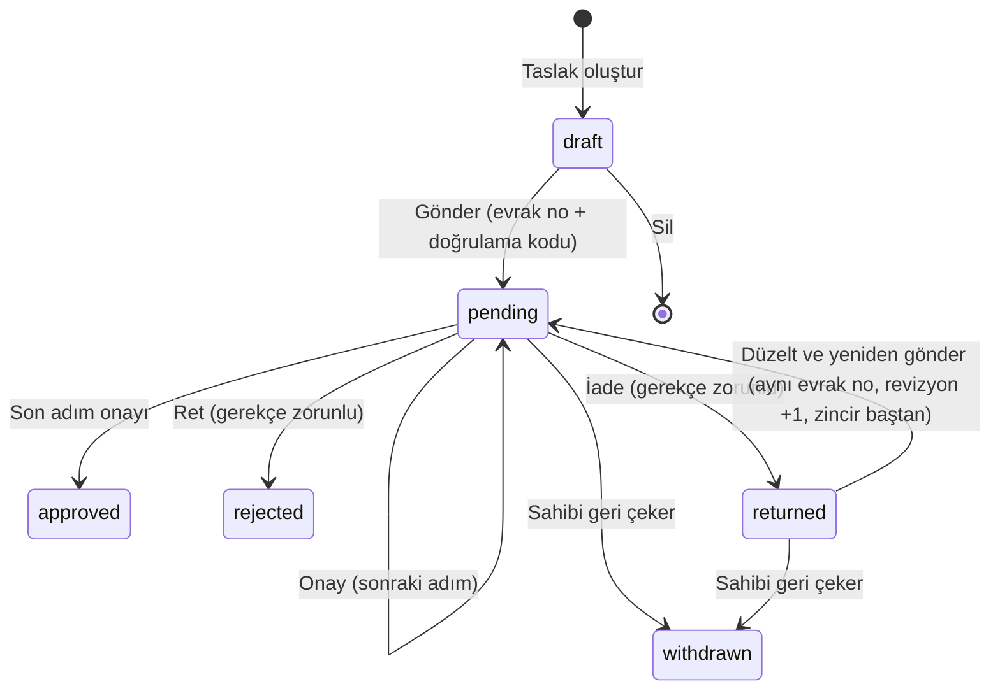
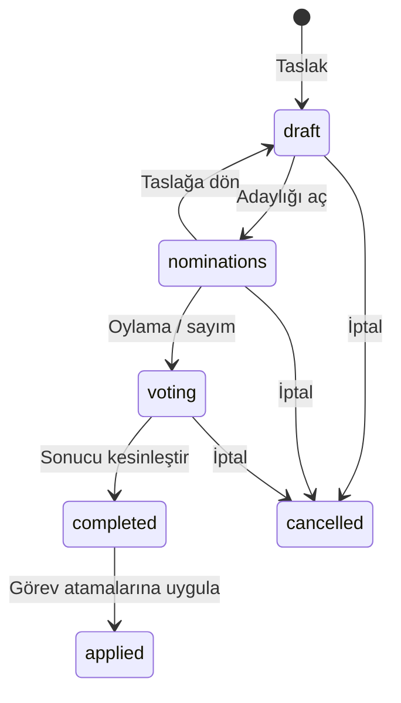

# Uygulanan Mimari (Spark planı)

Bu doküman Hub'ın **şu anda çalışan** mimarisini ve veri modelini anlatır. Gerekçeler: [ADR-0017](../adr/0017-ucretsiz-spark-plani-kurallar-tek-guvenilir-katman.md) (Spark, kurallar), [ADR-0018](../adr/0018-firestore-bolgesi-europe-west1-ve-hub-uyeligi.md) (bölge, üyelik), [ADR-0019](../adr/0019-organizasyon-roller-ve-secimler-arayuzden-duzenlenir.md) (düzenlenebilir organizasyon), [ADR-0020](../adr/0020-dilekce-sablonlari-word-tabanli.md) (Word şablonları), [ADR-0021](../adr/0021-belge-ciktisi-tarayicida-docx-ve-dogrulama.md) (belge çıktısı), [ADR-0022](../adr/0022-birim-calisma-alanlari-ve-sekreterlik-defteri.md) (birim alanları ve Sekreterlik Defteri), [ADR-0023](../adr/0023-dilekce-kategori-katalogu-ve-toplu-word-aktarimi.md) (kategori kataloğu ve toplu Word aktarımı), [ADR-0024](../adr/0024-coklu-makam-onayi-ve-nisap.md) (çoklu makam/nisap), [ADR-0025](../adr/0025-secim-yasam-dongusu-ve-kesinlesmis-sonuc.md) (seçim yaşam döngüsü), [ADR-0026](../adr/0026-word-belgesine-qr-dogrulama-damgasi.md) (Word QR damgası), [ADR-0027](../adr/0027-harici-firebase-ikincil-oturum.md) (harici Firebase), [ADR-0028](../adr/0028-birim-toplantilari-ve-kilitli-tutanak.md) (birim toplantıları), [ADR-0031](../adr/0031-ayri-kariyer-vitrini-ve-tarihli-birim-basvurulari.md) (kariyer vitrini ve başvurular), [ADR-0033](../adr/0033-onay-makamlarinin-belge-alanlarini-doldurmasi.md) (makamların belge alanları) ve [ADR-0034](../adr/0034-kurul-oylamalari-ve-numarali-karar-defteri.md) (kurul oylamaları ve numaralı karar defteri).

[Sistem mimarisi](sistem-mimarisi.md) ve [Firestore veri modeli](firestore-veri-modeli.md) dokümanları Blaze/Functions varsayımıyla yazılmıştır; hedef mimari olarak arşivde tutulur. Kod ile bu doküman çelişirse **kod esas alınır** ([dokümantasyon kuralları §2](../dokumantasyon-kurallari.md)).

## 1. Bileşenler

```mermaid
flowchart LR
    U[Tarayıcı<br/>React + Mantine] -->|Google / e-posta girişi| A[Firebase Auth<br/>Spark]
    U -->|okuma/yazma| F[(Cloud Firestore<br/>europe-west1)]
    F -. her istekte .-> R{{Security Rules<br/>firebase/firestore.rules}}
    H[Hub Firebase Hosting] -->|iç SPA| U
    K[Kariyer Firebase Hosting] -->|açık ilan vitrini| U
    V[Harici doğrulayıcı] -->|/dogrula/kod| H
    V -->|tek doküman okuması| F
    U -->|ayrı kullanıcı oturumu| EA[Harici Firebase Auth]
    U -->|izinli koleksiyon/yollar| EF[(IEEE Puan / harici Firebase)]
    EF -. uzak proje kuralları .-> ER{{Harici Security Rules}}
```

| Katman | Teknoloji | Not |
|---|---|---|
| Arayüz | React 19, Vite, Mantine 9, React Router | Türkçe, mobil uyumlu, açık/koyu tema. Sayfalar tembel yüklenir. |
| Kimlik | Firebase Auth | Google ve e-posta/şifre. İlk girişte üyelik başvurusu oluşur. |
| Veri | Cloud Firestore (`europe-west1`) | İstemci yerel önbelleği açık (okuma kotasını korur). |
| Güvenlik | Firestore Security Rules | Tek güvenilir katman; emülatörde testli. |
| Word | docxtemplater + PizZip (doldurma), docx (oluşturucu), docx-preview (önizleme) | Tamamı tarayıcıda. |
| Barındırma | Firebase Hosting multi-site | `hub` iç operasyon SPA'sı ve `career` aday vitrini; ortak Auth/Firestore, ayrı alan adları. |
| Sunucu kodu | **Yok** | Spark planı. |

## 2. Koleksiyonlar

| Koleksiyon | İçerik | Kim okur | Kim yazar |
|---|---|---|---|
| `system/bootstrap` | İlk kurulum kaydı | Giriş yapan herkes | Yalnızca kurulum yokken ilk kişi |
| `settings/public` | Kurum adı, logo, giriş notu | Herkes | `org.manage` |
| `settings/org` | Aktif dönem, evrak no biçimi, dilekçe kategori kataloğu, doğrulama adresi, izinli alan adları, vTools organizasyon/SPOID ayarları | Aktif üye | `org.manage` |
| `members/{uid}` | Ad, e-posta, telefon, bölüm, öğrenci no, durum | Kendisi, aktif üyeler | Kendisi (iletişim alanları), `members.manage` (durum) |
| `access/{uid}` | Erişim özeti: `superAdmin`, `perms{izin: bitiş}`, `roleKeys{"birim__rol": bitiş}`, `tokens[]` | Kendisi, `assignments.manage` | `assignments.manage`; `superAdmin` bayrağı yalnızca kurucu yönetici |
| `units/{id}` | Komite, başkanlık, departman… | Aktif üye | `org.manage` |
| `roles/{id}` | Unvan, kapsam, izinler | Aktif üye | `org.manage` |
| `terms/{id}` | Dönemler | Aktif üye | `org.manage` |
| `assignments/{id}` | Kişi + rol + birim + dönem + süre | Aktif üye (şeffaflık) | `assignments.manage` |
| `elections/{id}` | Seçim yaşam döngüsü; tür/yöntem, seçmen ve nisap, pozisyonlar, adaylar, oy sayımı, tutanak, kazanan | Aktif üye | `elections.manage`; kesinleşen sonuç kilitli |
| `petitionTemplates/{id}` | Şablon, kapsam, seri, taslak içerik | Aktif üye | `templates.manage` |
| `petitionTemplates/{id}/draftChunks/{i}` | Taslak .docx (base64 parça) | Aktif üye | `templates.manage` |
| `petitionTemplates/{id}/versions/{v}` (+ `/chunks`) | Yayımlanmış sürüm: alanlar, onay zinciri, .docx | Aktif üye | `templates.manage`, yalnızca oluşturma (değiştirilemez) |
| `counters/{SERİ}_{YIL}` | Evrak sayacı | Aktif üye | Yalnızca ilk gönderimle aynı batch'te, +1 |
| `petitions/{id}` | Dilekçe, veri, onay zinciri kopyası, onaylar, notlar | Sahibi, `visibleTo` eşleşenler, `petitions.readAll` | Aşağıdaki durum makinesine göre |
| `petitionVerifications/{kod}` | Herkese açık doğrulama özeti | Herkes (yalnızca `get`) | Dilekçeyle aynı batch'te, alan alan aynı |
| `auditLog/{id}` | Yönetim işlemleri | `audit.read` | Aktif üye, yalnızca kendi adına ekleme |
| `events/{id}` | Etkinlik yaşam döngüsü, kapanış raporu, HeptaCert/vTools hazırlığı | Aktif üye | Etkinlik sorumlusu, birim yöneticisi; onaylarda ayrı izin |
| `events/{id}/participants/{pid}` | HeptaCert kurumsal katılımcı kopyası | Etkinlik sorumlusu / birim yöneticisi | Aynı kapsam |
| `events/{id}/syncRuns/{rid}` | HeptaCert aktarım mutabakatı ve veri sözleşmesi sürümü | Etkinlik sorumlusu, birim yöneticisi, rapor okuyucu | Aktarımı yapan yetkili |
| `eventRestrictions/{id}` | Dönemler arası katılım engeli/dikkat kaydı; gerekçe ve değişmez geçmiş | `members.manage` | `members.manage`; silinmez, gerekçeyle pasifleştirilir |
| `eventRestrictionIndex/{emailHash}` | Açık kimlik ve gerekçe taşımayan katılımcı koruma indeksi | Aktif üye tekil `get`; yalnız `members.manage` liste | `members.manage`; tam kayıtla aynı işlemde |
| `secretaryLedger/{id}` | Toplantı, karar, gelen-giden evrak, takip ve not defteri | `secretary.ledger.manage` | `secretary.ledger.manage` |
| `meetings/{id}` | Birim toplantısı; katılım, gündem, görüşme, karar ve takip maddeleri | Birim üyeleri ve üst yetkililer | Birim toplantı/yönetim yetkilisi; kesinleşen kayıt kilitli |
| `settings/boards` | YK/İK adları, tüzükteki tam sayılar ve oy hakkı veren görev koltukları | Aktif üye | `org.manage` |
| `boardVotes/{id}` + `ballots/{uid}` | Dondurulmuş kurul listesiyle açık oylama ve kişiye ait pusula | İlgili kurul üyeleri ve kurul yöneticisi | Kurul yöneticisi; pusulayı yalnız sahibi ve geçerli rolü varken |
| `boardDecisions/{id}` | Numaralı, kaynak bağlantılı YK/İK/ortak karar defteri | Görünürlük politikasına göre aktif üyeler/kurul | Kurul yöneticisi; yalnız oluşturma |
| `decisionCounters/{kurul_yıl}` | Kurul ve yıl bazlı boşluksuz karar sayacı | Aktif üye | Kararla aynı işlemde yalnız +1 |
| `externalIntegrations/firebase` | Harici Firebase web yapılandırması ve izin verilen veri yolları; gizli anahtar içermez | `external.firebase.manage` | `external.firebase.manage` |
| `statutes/current` | Herkese açık güncel tüzük üstverisi | Herkes | Organizasyon yöneticisi / Genel Sekreter |
| `statuteVersions/{id}` + `chunks` | Değiştirilemez PDF/Word tüzük sürümü ve dosya parçaları | Herkes | Organizasyon yöneticisi / Genel Sekreter; yalnız oluşturma |
| `assets/{id}` | Fiziksel demirbaş, konum, kondisyon ve zimmet durumu | Envanter/finans/sekreterlik/operasyon yetkilileri | Envanter, finans veya sekreterlik yöneticisi |
| `assetMovements/{id}` | Değiştirilemez zimmet, iade, taşıma, bakım, kayıp ve hurda hareketi | Demirbaş okuyucuları | Demirbaş yöneticileri; yalnız oluşturma |
| `recruitmentCalls/{id}` | Komite/YK tarihli alım ilanı, kontenjan ve özel sorular | Açık ilanlar herkes; taslak/kapalı ilan ilgili yönetici | İlgili `unit.manage` veya `assignments.manage`; silinmez |
| `recruitmentCalls/{id}/internal/meta` | İlanı açan kişinin uid ve adı (herkese açık ilan belgesinde tutulmaz) | Yalnız ilgili yönetici | İlanla aynı batch'te bir kez; değişmez |
| `recruitmentApplications/{ilan__uid}` | Aday kimliği, iletişim, form yanıtları ve değerlendirme durumu | Başvuru sahibi ve ilgili birim yöneticisi | Aday ilk gönderim/geri çekme; ilgili yönetici değerlendirme |
| `recruitmentApplications/{id}/internal/review` | Son değerlendirenin uid ve adı (adaya gösterilmez) | Yalnız ilgili yönetici | Karar güncellemesiyle aynı batch'te |
| `privacyNotices/{id}` | Politika sürümü (`recruitment`, `members`, `cookies`, `terms`); yürürlükteki sürümler `settings/public` işaretçilerinde | Herkes | `org.manage`; yalnız oluşturma, değiştirilemez |

## 3. Yetki modeli

- **Görev ataması** (`assignments`) = kişi + rol + birim (`branch` = kol geneli) + dönem + başlangıç/bitiş.
- Atama değiştiğinde istemci, kişinin tüm aktif atamalarından **erişim özetini** (`access/{uid}`) yeniden hesaplar (`apps/hub/src/lib/access.ts → computeAccess`):
  - `perms`: rolün kol geneli izinleri → bitiş zamanı,
  - `roleKeys`: `"birim__rol"` → bitiş zamanı (onay yetkisi),
  - `tokens`: dilekçe görünürlük anahtarları (`uid:…`, `role:birim__rol`, `unit:birim` — `unit.petitions.read` izni alt birimlere de yayılır).
- Kurallar her istekte `access/{uid}` dokümanını okur ve **bitiş zamanını `request.time` ile karşılaştırır**; süresi dolan yetki kendiliğinden düşer.

## 4. Dilekçe durum makinesi

```mermaid
stateDiagram-v2
    [*] --> draft: Taslak oluştur
    draft --> pending: Gönder (evrak no + doğrulama kodu)
    draft --> [*]: Sil
    pending --> pending: Onay (sonraki adım)
    pending --> approved: Son adım onayı
    pending --> rejected: Ret (gerekçe zorunlu)
    pending --> returned: İade (gerekçe zorunlu)
    returned --> pending: Düzelt ve yeniden gönder (aynı evrak no, revizyon +1, zincir baştan)
    pending --> withdrawn: Sahibi geri çeker
    returned --> withdrawn: Sahibi geri çeker
```

Her geçişin kuralı `firebase/firestore.rules` içindeki `petitions` bloğundadır ve `firebase/tests/rules.test.ts` ile test edilir. Bir onay adımı “rollerden biri”, “tüm makamlar” veya “belirli sayıda makam” politikası kullanabilir. Aynı rol aynı adımda bir kez sayılır; nisap tamamlanmadan sonraki adıma geçilmez. Şablon alanları bir onay adımına bağlanabilir; bu alanlar başvuru sahibinin `data` haritasından ayrı `approvalData` içinde tutulur ve yalnız etkin makam tarafından bir kez doldurulur (ADR-0033).

## 5. Word şablon hattı

1. Yönetici Word dosyasını yükler **veya** sistem içi oluşturucuyla .docx üretir.
2. `{etiket}`'ler algılanır → form alanları (tür, zorunluluk, profilden doldurma düzenlenir).
3. Makamların dolduracağı işaret/gerekçe alanları ilgili onay adımına bağlanır; onay zinciri tanımlanır → **Yayımla** → değiştirilemez sürüm.
4. Üye şablonu seçer, formu doldurur; sağda belge canlı önizlenir.
5. Gönderim/onay sonrası belge her açılışta şablon + veri + onaylardan yeniden üretilir; `.docx` indirilir veya tarayıcıdan PDF'e yazdırılır.
6. Doğrulama kodu bulunan çıktının sonuna durum, evrak no, kod ve herkese açık doğrulama adresini taşıyan gömülü QR damgası eklenir.

Harici IEEE Puan görünümü `users/*/sadakat`, üyelik onayı, yaşam boyu toplamlar ve `leaderboard_public` önbelleğini uzak RTDB içinde yönetir. Toplu sıfırlama yalnız güncel puanı sıfırlar; puan veya üyelik değişikliği, sıralama ve `admin_point_audit` kaydı tek çok-yollu RTDB güncellemesidir. Bu kişisel veriler Hub Firestore'una kopyalanmaz (ADR-0035).

Etkinlik takvimi ayrı bir koleksiyona kopya yazmaz. Tarihi bulunan onaylı/süreçteki `events` kayıtlarını canlı sorgudan gösterir; onaylanan etkinlik bu nedenle otomatik görünür. Aynı görünüm standart iCalendar (`.ics`) dışa aktarımı üretir (ADR-0036).

## 6. Seçim durum makinesi

```mermaid
stateDiagram-v2
    [*] --> draft: Taslak
    draft --> nominations: Adaylığı aç
    nominations --> draft: Taslağa dön
    nominations --> voting: Oylama / sayım
    voting --> completed: Sonucu kesinleştir
    completed --> applied: Görev atamalarına uygula
    draft --> cancelled: İptal
    nominations --> cancelled: İptal
    voting --> cancelled: İptal
```

Kesinleştirme; seçmen/nisap, oy toplamları, kazananlar ve eşitlik çözüm notlarını kontrol eder. `completed` ve `applied` kayıtları değiştirilemez. Hub fiziksel gizli oy–açık sayım, açık oylama ve atama sonuçlarını kaydeder; Spark/istemci mimarisinde çevrim içi gizli oy toplamaz.

## 7. Ücretsiz kota bütçesi (Spark)

| Kaynak | Günlük kota | Tahmini kullanım (100 aktif üye) |
|---|---|---|
| Firestore okuma | 50.000 | ~5.000–10.000 (yerel önbellek + canlı dinleyiciler) |
| Firestore yazma | 20.000 | < 1.000 |
| Firestore depolama | 1 GiB | Şablon başına ~0,1–4 MB; dilekçe başına birkaç KB |
| Hosting aktarımı | 360 MB | İlk açılış ~500 KB (gzip), sonrası önbellekten |

Kota aşılırsa Hub ertesi güne (Pasifik saatiyle gece yarısı) kadar hata verir; **ücret doğmaz.**
