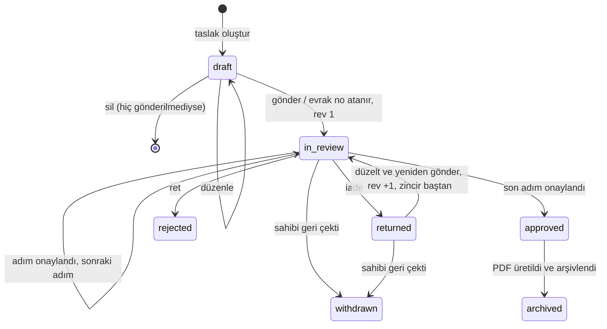

# E-Dilekçe ve Rol Bazlı İmza Modülü — Fonksiyonel Tanım

> **Güncelleme (2026-09-24):** Şablonlar artık Word (.docx) tabanlıdır ve Hub'dan yüklenir/oluşturulur ([ADR-0020](../../adr/0020-dilekce-sablonlari-word-tabanli.md)); belge tarayıcıda üretilir ([ADR-0021](../../adr/0021-belge-ciktisi-tarayicida-docx-ve-dogrulama.md)); kontroller Security Rules'tadır ([ADR-0017](../../adr/0017-ucretsiz-spark-plani-kurallar-tek-guvenilir-katman.md)). Hem kol geneli hem komite içi dilekçeler desteklenir. Uygulanan akış: [Uygulanan mimari §4–5](../../mimari/uygulanan-mimari.md).

| | |
|---|---|
| Çalışma paketi | [WP-12](../../work-packages/WP-12-e-dilekce.md) |
| Süreç sahibi | Genel Sekreterlik (Bildirge §8.3) |
| Operasyon sorumlusu | Evrak ve Arşiv Sorumlusu (`fn.records`), Mevzuat ve Arşiv Yönetimi Departmanı |
| Teknik sorumlu | TechOps |
| İlgili ADR'ler | [0011](../../adr/0011-dilekce-sablonlari-kod-olarak.md), [0012](../../adr/0012-rol-bazli-elektronik-onay.md), [0013](../../adr/0013-dilekce-onay-akisi.md), [0014](../../adr/0014-evrak-numaralandirma.md), [0015](../../adr/0015-pdf-uretimi-ve-dogrulama.md) |

## 1. Amaç

IEEE İKÇÜ'nün kendi dilekçe formatlarının:

1. Hub üzerinden **çevrim içi doldurulması**,
2. Şablonda tanımlı **onay zincirine** göre, rol sahipleri tarafından **çevrim içi imzalanması**,
3. Gönderimde **evrak numarası** alması,
4. Nihai onay sonrasında **kurumsal başlıklı, doğrulanabilir PDF** olarak üretilmesi ve arşivlenmesi.

Hedef; dilekçelerin WhatsApp üzerinden Word dosyası olarak dolaşmasını, imza için kişilerin fiziksel olarak bulunmasının beklenmesini ve evrak geçmişinin kaybolmasını önlemektir.

## 2. Kapsam

### Dahil
- Sürümlü dilekçe şablonları (alanlar, dilekçe metni, onay zinciri, PDF düzeni)
- Taslak kaydetme, önizleme, gönderme
- Sıralı onay adımları, ikame roller, koşullu adımlar
- Onay / ret / iade kararları ve gerekçe
- Evrak numarası
- PDF üretimi, QR ile doğrulama
- Uygulama içi bildirim ve e-posta hatırlatması
- Denetim kaydı, saklama süresi

### Hariç (ilk dönem)
- 5070 sayılı Kanun kapsamında güvenli elektronik imza (e-imza kartı / mobil imza) ([ADR-0012](../../adr/0012-rol-bazli-elektronik-onay.md))
- Hub içinden görsel şablon tasarlama aracı (şablonlar kodla tanımlanır, [ADR-0011](../../adr/0011-dilekce-sablonlari-kod-olarak.md))
- Paralel (aynı anda birden çok zorunlu imzacı) onay adımları
- Üniversite sistemlerine (EBYS vb.) otomatik gönderim

## 3. Kullanıcılar ve senaryolar

| # | Aktör | Senaryo |
|---|---|---|
| S1 | Üye | Şablon kataloğundan bir dilekçe seçer, formu doldurur, taslak kaydeder, önizler ve gönderir. |
| S2 | Üye | "Dilekçelerim" sayfasında dilekçenin hangi adımda, kimde beklediğini görür. |
| S3 | İmzacı (örn. Komite Başkanı) | "İmza Bekleyenler" kutusunda dilekçeyi açar, içeriği inceler ve onaylar / reddeder / iade eder. |
| S4 | Üye | İade edilen dilekçeyi düzeltir ve yeniden gönderir. Yeni revizyon oluşur, onay zinciri baştan başlar. |
| S5 | Üye | Nihai karar verilmeden dilekçesini geri çeker. |
| S6 | Genel Sekreter | Tüm dilekçeleri durum, şablon, birim ve tarihe göre süzer. Geciken adımları görür. |
| S7 | Evrak Sorumlusu | Onaylanan dilekçelerin PDF'lerini arşivler. Şablon sürümlerini etkinleştirir veya emekliye ayırır. |
| S8 | Harici kişi (örn. üniversite personeli) | PDF'teki QR kodu okutarak belgenin Hub'da kayıtlı ve onaylı olduğunu doğrular. |

## 4. Durum makinesi

| Durum | Kod | Düzenlenebilir mi? | Açıklama |
|---|---|---|---|
| Taslak | `draft` | Evet (yalnızca sahibi) | Evrak numarası yok. Sahibi silebilir. |
| İncelemede | `in_review` | Hayır | Aktif bir onay adımı var. |
| İade edildi | `returned` | Evet (yalnızca sahibi) | İmzacı gerekçe yazarak iade etti. |
| Onaylandı | `approved` | Hayır | Tüm adımlar onaylandı. PDF üretimi tetiklenir. |
| Reddedildi | `rejected` | Hayır | Nihai durum. Evrak numarası kullanılmış kalır. |
| Geri çekildi | `withdrawn` | Hayır | Nihai durum. |
| Arşivlendi | `archived` | Hayır | PDF'in hash değeri kaydedildi, arşiv kopyası oluşturuldu. |

## 5. Onay zinciri kuralları (özet)

Ayrıntı: [ADR-0013](../../adr/0013-dilekce-onay-akisi.md)

- Adımlar **sıralıdır**. Bir adım, önceki adım onaylanmadan açılmaz.
- Her adımda bir veya birden çok **kabul edilen rol** vardır. Bu rollerden birini taşıyan **bir** kişinin kararı yeterlidir.
- **Kapsam çözümü:** Adımdaki `unit.chair` gibi birim rolleri, dilekçe sahibinin gönderim anındaki biriminde (veya şablonun belirttiği birimde) aranır.
- **İkame:** Şablon izin veriyorsa başkan yardımcısı başkan yerine imzalayabilir. PDF'e "… adına" olarak basılır.
- **Kendi dilekçesini onaylama yasağı:** Dilekçe sahibi kendi dilekçesinin hiçbir adımını imzalayamaz. Adımda başka uygun imzacı yoksa adım, şablonda tanımlı `fallback` rolüne yükselir.
- **Koşullu adım:** Adım yalnızca belirli bir alan değerinde devreye girebilir (örn. kampüs dışı etkinlikte Danışman onayı).
- **Rol boşluğu:** Adımdaki rolü taşıyan kimse yoksa adım `fallback` rolüne yükselir. `fallback` da boşsa dilekçe GS'nin "Takılı Dilekçeler" listesine düşer.

## 6. Ekranlar

| Ekran | Yol | Erişim |
|---|---|---|
| Şablon kataloğu | `/dilekceler/yeni` | `petition.template.read` |
| Dilekçe formu | `/dilekceler/yeni/:templateId` ve `/dilekceler/:id/duzenle` | Sahibi, `draft`/`returned` durumunda |
| Önizleme | Form içinde sekme | Sahibi (tarayıcıda "TASLAK" filigranlı PDF) |
| Dilekçelerim | `/dilekceler` | Sahibi |
| İmza bekleyenler | `/imza` | Aktif adımda uygun imzacı |
| Dilekçe detayı | `/dilekceler/:id` | `petition.read`. Zaman çizelgesi, imza geçmişi, revizyon farkları |
| Tüm dilekçeler | `/yonetim/dilekceler` | GS, Başkan, Evrak (B); B.Yrd.+ (U) |
| Şablon yönetimi | `/yonetim/dilekce-sablonlari` | `petition.template.manage` |
| Doğrulama | `/dogrula/:code` | Herkese açık |

### İmza ekranı davranışı

1. İmzacı dilekçenin **tam içeriğini** ve PDF önizlemesini görür.
2. Birden çok uygun rolü varsa, hangi rolüyle imzaladığını seçer (örn. "CS Komite Başkanı olarak").
3. Karar seçer: **Onayla** / **İade Et** / **Reddet**. İade ve ret için gerekçe zorunludur.
4. Onay beyanı kutusunu işaretler: *"Bu dilekçenin içeriğini okudum; seçtiğim rolüm adına kararımı elektronik olarak veriyorum."*
5. Son 5 dakika içinde giriş yapılmamışsa şifresini yeniden girer (MFA varsa ikinci faktör de istenir).
6. Sunucu kararı kaydeder. Ekran, imza kaydının kısa özetini ve doğrulama kodunu gösterir.

## 7. Bildirimler

| Olay | Alıcı | Kanal |
|---|---|---|
| Adım açıldı | Adımın uygun imzacıları | Uygulama içi + e-posta |
| Adım 3 gündür bekliyor | Uygun imzacılar + GS | E-posta (günlük özet) |
| İade edildi / reddedildi | Dilekçe sahibi | Uygulama içi + e-posta |
| Onaylandı (PDF hazır) | Dilekçe sahibi, şablonda tanımlı bilgi alıcıları | Uygulama içi + e-posta |

E-posta gövdesinde dilekçe içeriği **yer almaz**. Yalnızca başlık, evrak numarası ve Hub bağlantısı gönderilir (veri minimizasyonu).

## 8. KVKK

- Her şablon, topladığı her alan için **amaç** ve **veri sınıfı** (`public`, `internal`, `personal`, `sensitive`) beyan eder. `sensitive` (özel nitelikli) alan içeren şablon CI doğrulamasından geçmez (Bildirge §12.3).
- T.C. kimlik numarası gibi alanlar, şablonun gerçek bir zorunluluğu belgelenmeden eklenmez.
- Saklama süresi şablon bazında tanımlanır. Varsayılan süre dönem sonu + 2 akademik yıldır (AS-09). Süre dolunca içerik silinir veya anonimleştirilir. Evrak numarası, şablon, tarih ve durum (kimliksiz üst veri) evrak defteri olarak kalır.
- Silme ve düzeltme talepleri Bildirge §12.6'ya göre diğer sistemlerle birlikte değerlendirilir. Onaylanmış bir dilekçenin içeriği **düzeltilmez**. Gerekirse yeni bir dilekçe açılır ve eskisine bağlantı verilir.
