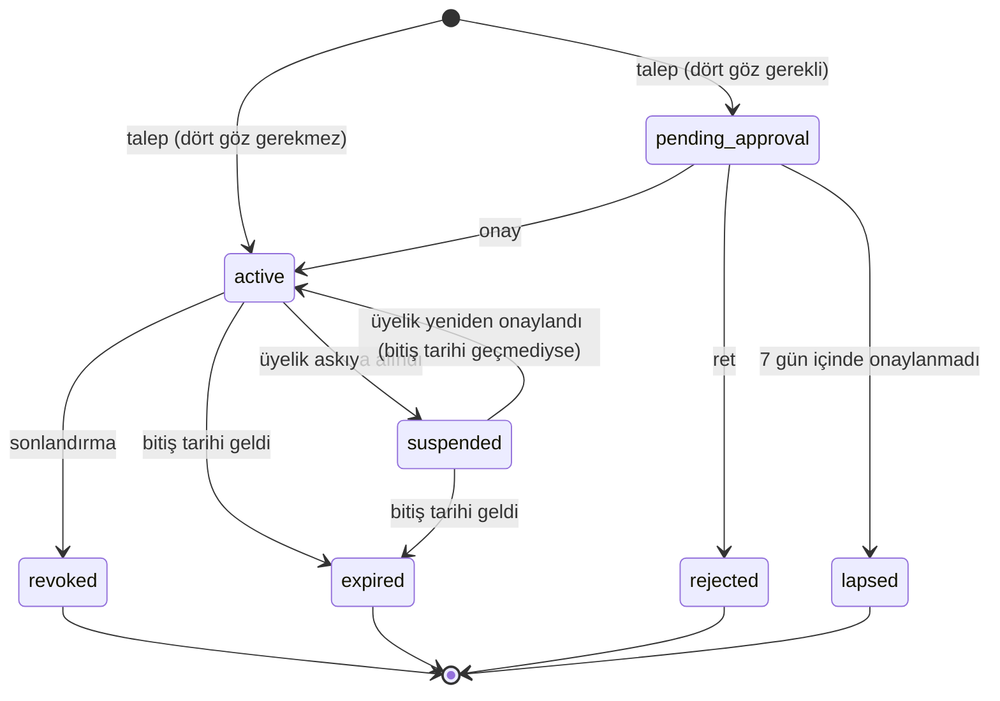

# Rol Atama Kuralları

> **Güncelleme (2026-09-24):** Uygulamada atama `assignments.manage` iznine bağlıdır; birim başkanlarının kendi biriminde atama yapması ve dört göz onayı (ADR-0008) sonraki sürüme bırakılmıştır.

Kim, kime, hangi rolü, hangi onayla verebilir? Bu doküman [ADR-0007](../adr/0007-donem-bazli-rol-atamalari.md) (dönem bazlı atamalar) ve [ADR-0008](../adr/0008-kritik-atamalarda-dort-goz.md) (dört göz ilkesi) kararlarının uygulama kurallarını içerir.

## 1. Genel kurallar

1. **Kimse kendine rol atayamaz, kendi atamasını onaylayamaz.** Talep eden, onaylayan ve atanan kişi birbirinden farklı olmalıdır.
2. Her atama bir **döneme** (`termId`) bağlıdır ve bir **bitiş tarihi** vardır. Bitiş tarihi, dönem bitiş tarihinden sonra olamaz.
3. Her atama, talep, onay, ret ve sonlandırma işlemi **denetim kaydına** yazılır ([ADR-0009](../adr/0009-degistirilemez-denetim-kaydi.md)).
4. Rol ataması yalnızca **onaylı üyelere** yapılabilir. İstisna: `branch.advisor`. Danışman üye olmayabilir; bu rol yalnızca Başkan ve GS tarafından, dört göz onayıyla verilir.
5. Atama **sonlandırma** tek adımda yapılır, dört göz onayı gerekmez. Yetki kaldırmak güvenliği artırır; gecikmesi risklidir.
6. Onay bekleyen talepler **7 gün** içinde onaylanmazsa otomatik olarak düşer.

## 2. Atama yetki tablosu

| Atanacak rol | Talep edebilir | Dört göz onayı | Onaylayabilir | Sonlandırabilir |
|---|---|---|---|---|
| `branch.chair` | Başkan (devir için), GS | Evet | KBY, GS, Başkan (talep edenden farklı) | Başkan, GS |
| `branch.vice_chair`, `branch.secretary`, `branch.treasurer` | Başkan, GS | Evet | Başkan, KBY, GS (talep edenden farklı) | Başkan, GS |
| `board.member` | Başkan, GS | Evet | Başkan, KBY, GS (talep edenden farklı) | Başkan, GS |
| `branch.advisor` | Başkan, GS | Evet | Başkan, GS (talep edenden farklı) | Başkan, GS |
| `fn.*` (tüm fonksiyonel roller) | Başkan, GS | Evet | Başkan, KBY, GS (talep edenden farklı) | Başkan, GS |
| `sys.admin` | Başkan, TechOps birim başkanı (`unit.chair @ techops`) | Evet | Başkan, GS (talep edenden farklı) | Başkan, GS, TechOps birim başkanı |
| `unit.chair @ X` | Başkan, GS | Evet | Başkan, KBY, GS (talep edenden farklı) | Başkan, GS |
| `unit.vice_chair @ X` | `unit.chair @ X` veya üst birim başkanı, Başkan, GS | Evet | Başkan, KBY, GS | `unit.chair @ X`, Başkan, GS |
| `unit.coordinator @ X` | `unit.chair` / `unit.vice_chair @ X` veya üst birim | Hayır | — | `unit.chair` / `unit.vice_chair @ X`, Başkan, GS |
| `unit.volunteer @ X` | `unit.chair` / `unit.vice_chair` / `unit.coordinator @ X` veya üst birim | Hayır | — | `unit.chair` / `unit.vice_chair @ X`, Başkan, GS |

"Üst birim" ifadesi, X'in atası olan bir birimde aynı veya daha yüksek birim rolünü taşıyan kişiyi ifade eder. Örnek: `techops` başkanı `techops-mevzuat` departmanına koordinasyon üyesi atayabilir.

## 3. Atama yaşam döngüsü

`startsAt` tarihi gelecekte olan onaylı atama `active` durumunda tutulur, ancak `startsAt` gelene kadar erişim özetine yansımaz (devir penceresi, §5).

## 4. Ön yükleme (bootstrap)

Sistem ilk kurulduğunda onay verebilecek kimse yoktur. Bu nedenle:

1. Firebase projesinin iki sahibinden biri `scripts/bootstrap-admins.ts` betiğini Admin SDK ile çalıştırır.
2. Betik yalnızca **boş** bir `roleAssignments` koleksiyonunda çalışır. Kayıt varsa durur.
3. Betik yalnızca `branch.chair` ve `branch.secretary` atamalarını, iki **farklı** kişiye yapar.
4. Denetim kaydına `source: "bootstrap"` ve betiği çalıştıranın Google hesabı yazılır.
5. Sonraki tüm atamalar Hub üzerinden, bu dokümandaki kurallarla yapılır.

## 5. Dönem devri

- Yeni dönemin atamaları, eski dönemin bitişinden **en fazla 30 gün önce** başlayacak şekilde girilebilir (devir penceresi). Bu sürede eski ve yeni sorumlular aynı anda yetkili olur.
- Eski dönemin atamaları dönem bitişinde otomatik olarak `expired` olur. Uzatma yapılmaz; aynı kişi yeni dönemde görev alıyorsa yeni atama yapılır.
- Dönem bitişinden 14 gün önce **devir raporu** üretilir: dönem sonunda yetkisini kaybedecek kişiler, yeni dönemde sahipsiz kalacak roller, onay bekleyen dilekçeler ve açık görevler (WP-10, WP-11).

## 6. Otomatik durum değişiklikleri

| Tetikleyici | Etki |
|---|---|
| Üyelik RTDB'de `suspended` / `terminated` oldu | Kişinin tüm aktif atamaları `suspended` olur, erişim özeti hemen yeniden hesaplanır. Bekleyen imza adımları başka uygun imzacılara açılır. |
| Birim arşivlendi | Birime bağlı tüm aktif atamalar `revoked` olur (gerekçe: birim arşivlendi). |
| Atama bitiş tarihi geçti | Her gün 03:00'te (Europe/Istanbul) çalışan zamanlanmış görev, atamayı `expired` yapar. Güvenlik kuralları ayrıca `access.validUntil` alanını kontrol eder; zamanlanmış görev gecikse bile erişim süresinde kapanır. |

## 7. Harici sistemlere yansıma

Hub'daki rol değişiklikleri Google Groups, Drive, GitHub, HeptaCert ve WordPress erişimlerini **otomatik olarak değiştirmez** (ilk dönem kapsamı). Bunun yerine:

- Her atama değişikliğinde ilgili sistemler için bir **erişim görevi** oluşturulur. Örnek: "Ayşe Y. — `cs-komite@` Google Group'una ekle."
- Kapatılmamış erişim görevleri veri kalitesi uyarısı olarak raporlanır (Bildirge §11.8: "Erişimi kapatılmamış eski kullanıcı").
- Google Groups otomasyonu, Workspace yönetici erişimi sağlanırsa ikinci dönemde değerlendirilir.
