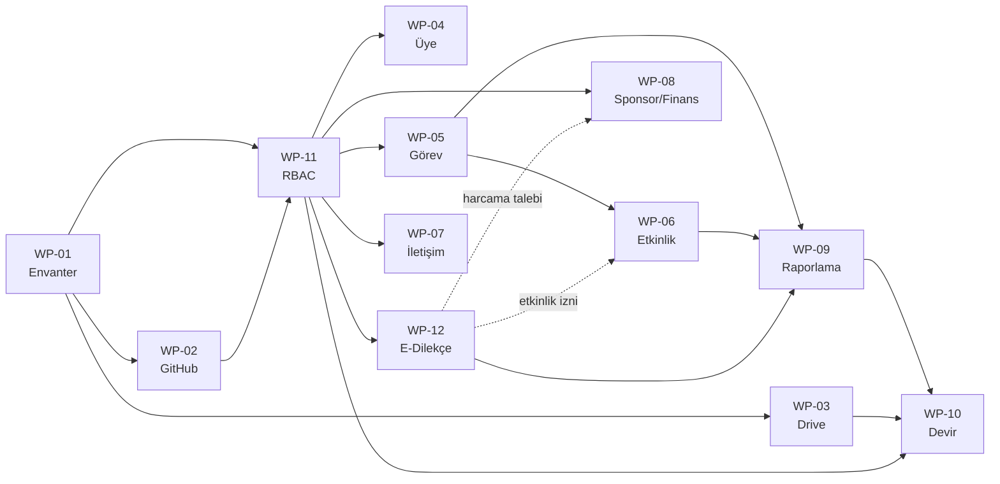

# Çalışma Paketleri

WP-01 … WP-10, Bildirge §9'daki paketlerdir ve numaraları korunmuştur. WP-11 ve WP-12 bu dokümantasyonla eklenmiştir. Yeni paket için [şablonu](_sablon.md) kullanın.

## Paket listesi

| WP | Başlık | Süreç sahibi | Takvim (hafta) | Durum |
|---|---|---|---|---|
| [WP-01](WP-01-dijital-yonetisim-ve-envanter.md) | Dijital yönetişim ve sistem envanteri | TechOps | 1–4 | Planlandı |
| [WP-02](WP-02-github-ve-kaynak-kod.md) | GitHub ve kaynak kod yönetimi | TechOps | 5–6 | Planlandı |
| [WP-03](WP-03-drive-ve-yonetim-devri.md) | Drive ve yönetim devri | TechOps / Genel Sekreter | 5–6 | Planlandı |
| [WP-04](WP-04-uye-ve-gonullu-yonetimi.md) | Üye ve gönüllü yönetimi | Üyelik sorumlusu | 7–8 | Planlandı |
| [WP-05](WP-05-gorev-ve-proje-yonetimi.md) | Görev ve proje yönetimi | Komite başkanları | 7–8 | Planlandı |
| [WP-06](WP-06-etkinlik-ve-heptacert.md) | Etkinlik yönetimi ve HeptaCert entegrasyonu | Etkinlik sorumluları | 9–10 | Planlandı |
| [WP-07](WP-07-iletisim-yonetimi.md) | İletişim yönetimi | İletişim birimi | 11–12 | Planlandı |
| [WP-08](WP-08-sponsorluk-ve-finans.md) | Sponsorluk ve finans | Sayman / Sponsorluk sorumlusu | 11–12 | Planlandı |
| [WP-09](WP-09-raporlama-ve-otomasyon.md) | Raporlama ve otomasyon | TechOps / Genel Sekreter | 13–14 | Planlandı |
| [WP-10](WP-10-egitim-gecis-ve-devir.md) | Eğitim, geçiş ve yönetim devri | TechOps / Yönetim Kurulu | 15–16 | Planlandı |
| [WP-11](WP-11-rbac.md) | **Kimlik, rol ve yetki yönetimi (RBAC)** | Yönetim Kurulu / TechOps | 1–8 | Planlandı |
| [WP-12](WP-12-e-dilekce.md) | **E-Dilekçe ve rol bazlı imza** | Genel Sekreterlik | 1–4 (envanter), 7–12 (geliştirme) | Planlandı |

## Bağımlılıklar

**Kritik yol:** WP-01 → WP-11 → WP-12 / WP-05 → WP-09 → WP-10. WP-11 gecikirse, yetki gerektiren tüm modüller gecikir.

## Güncellenmiş birinci dönem takvimi

Bildirge §13 takviminin iki geliştirme hattına bölünmüş hâlidir. Takvim YK kararıyla güncellenebilir (Bildirge §13).

| Hafta | Hat A: Operasyon modülleri | Hat B: RBAC ve E-Dilekçe | Kilometre taşı |
|---|---|---|---|
| 1–2 | WP-01 sistem, hesap ve veri envanteri | WP11-T01 organizasyon envanteri, WP12-T01 dilekçe envanteri | Mevcut durum ve risk raporu |
| 3–4 | WP-01 süreç tasarımı | WP11-T02 yetki matrisi onayı, ADR'lerin YK kabulü, WP12-T02 onay zincirlerinin çıkarılması | **M1:** Yetki matrisi ve ADR'ler onaylı |
| 5–6 | WP-02 monorepo ve CI, WP-03 Drive ve Groups | WP-11 çekirdek: roller, atamalar, erişim özeti, kurallar, denetim kaydı | **M2:** Kurumsal teknik temel |
| 7–8 | WP-05 görev/proje, WP-04 üye/gönüllü | WP-11 arayüz ve ön yükleme; WP-12 şablon şeması ve PDF paketi | **M3:** Hub ilk sürümü (giriş, organizasyon, roller, görevler) |
| 9–10 | WP-06 etkinlik ve HeptaCert CSV | WP-12 çekirdek akış: gönderim, numaralandırma, imza | **M4:** İlk dilekçe uçtan uca (staging) |
| 11–12 | WP-07 iletişim, WP-08 sponsorluk/finans | WP-12 arayüz, bildirimler, doğrulama sayfası, ilk 3 şablon | **M5:** Ortak operasyon yapısı |
| 13 | WP-09 raporlama veri katmanı | WP-12 dilekçe metriklerinin raporlara eklenmesi | |
| 14 | WP-09 gösterge panelleri ve otomatik raporlar | Güvenlik testi (WP11-T20, WP12-T19) | **M6:** Otomatik raporlar |
| 15 | Pilot: gerçek etkinlik ve projeler | Pilot: gerçek dilekçeler | **M7:** Pilot sonuç ve hata raporu |
| 16 | WP-10 eğitim, kabul, dokümantasyon, devir | WP-10 devir raporu (RBAC) | **M8:** Dönem sonu kabul paketi |

## Kapasite varsayımı

Takvim, TechOps'ta haftada toplam ~20 saat ayırabilen **en az 3 geliştirici** varsayımıyla hazırlanmıştır. Bu kapasite yoksa önce Hat A'daki WP-07 ve WP-08 kapsamı daraltılır (kontrollü Sheet ile devam edilir, Bildirge §7). WP-11 kapsamı daraltılmaz, çünkü diğer tüm modüller ona dayanır.
